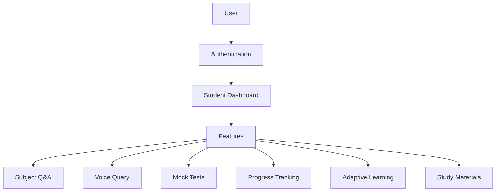
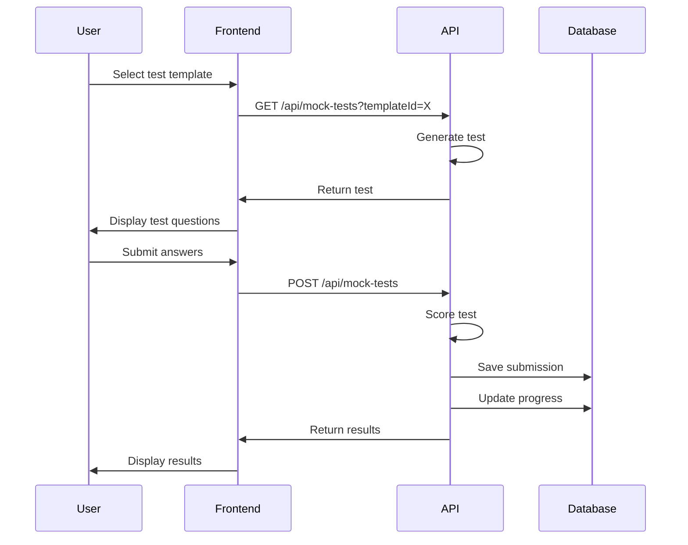
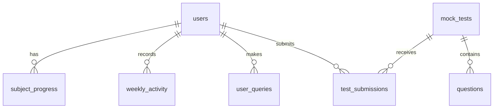

# CA Guru AI - Application Flow Documentation

## 1. Core Architecture



## 2. Authentication Flow

1. **Entry Point**: `src/app/page.tsx` (Landing Page)
2. **Authentication**: Handled by Clerk (`@clerk/nextjs`)
3. **User Paths**:
   - Unauthenticated users: Redirected to sign-in/sign-up pages
   - Authenticated users: Redirected to `/dashboard`

## 3. Dashboard Flow

### Student Dashboard (`/dashboard`)

The student dashboard serves as the central hub for all student features:

```
Dashboard
├── Subject Q&A (/dashboard/qa)
├── Voice Query (/dashboard/voice-query)
├── Mock Tests (/dashboard/mock-tests)
├── Progress Tracking (/dashboard/progress)
├── Adaptive Learning (/dashboard/adaptive-learning)
└── Study Materials (/dashboard/study-materials)
```

## 4. Feature Flows

### 4.1 Subject Q&A Flow

1. User selects a subject from the dropdown menu
2. User types a question and submits
3. Request is sent to `/api/qa` endpoint
4. Backend sends subject + query to DeepSeek API
5. Response is formatted and returned to the frontend
6. Answer is displayed with appropriate markdown formatting
7. User's progress is updated in the database

### 4.2. Voice Query Flow

1. User clicks the microphone button to start recording
2. Web Speech API transcribes speech to text
3. User reviews transcript and submits
4. Request is sent to `/api/voice-query` endpoint
5. Backend processes the query, detecting subject area
6. Query is sent to DeepSeek API with appropriate context
7. Response is displayed with markdown formatting
8. User's progress is updated in the database

### 4.3. Mock Tests Flow

1. User selects a mock test template
2. Test is generated:
   - First attempt to use AI-generated questions via `/lib/question-generator.ts`
   - Fallback to predefined question banks if AI generation fails
3. Test timing begins
4. User answers questions (MCQ or subjective)
5. User submits test
6. Test is scored (MCQs automatically, subjective marked as requiring manual evaluation)
7. Results are saved to database
8. User progress is updated
9. User is shown test results and correct answers



### 4.4. Progress Tracking Flow

1. User's actions across the platform are recorded
2. Progress data is stored in the database through `/api/progress` endpoints
3. Dashboard visualizes:
   - Streak data (consecutive daily logins)
   - Subject performance
   - Test scores
   - Weekly activity

### 4.5. Adaptive Learning Flow

1. System analyzes user's performance data
2. Identifies weak areas based on test scores and subject accuracy
3. Recommends specific topics for improvement
4. Suggests relevant study materials based on weak areas
5. Creates personalized learning path

## 5. Database Structure

The application uses PostgreSQL (Neon.tech) with the following structure:

```
Database Schema
├── users
├── user_queries
├── subject_progress
├── weekly_activity
├── mock_tests
├── questions
└── test_submissions
```

### Table Relationships:



## 6. API Structure

```
API Endpoints
├── /api/qa
├── /api/voice-query
├── /api/progress
├── /api/mock-tests
│   ├── GET (list tests/get specific test)
│   ├── POST (submit test)
│   ├── /history (get user's test history)
│   └── /results/:id (get specific test result)
└── /api/generate-questions (AI question generation)
```

## 7. Error Handling & Fallbacks

- Database unavailability: Graceful fallback to in-memory storage for critical features
- API failures: User-friendly error messages with appropriate status codes
- Authentication issues: Clear redirection to authentication screens
- AI service unavailability: Fallback to static content where possible

## 8. Technical Implementation Details

- **Frontend**: Next.js (App Router) with React 19
- **Styling**: Tailwind CSS for responsive design
- **Authentication**: Clerk for user management
- **Database**: PostgreSQL via Neon.tech
- **AI**: DeepSeek API for generating AI responses
- **Deployment**: Ready for Vercel deployment 